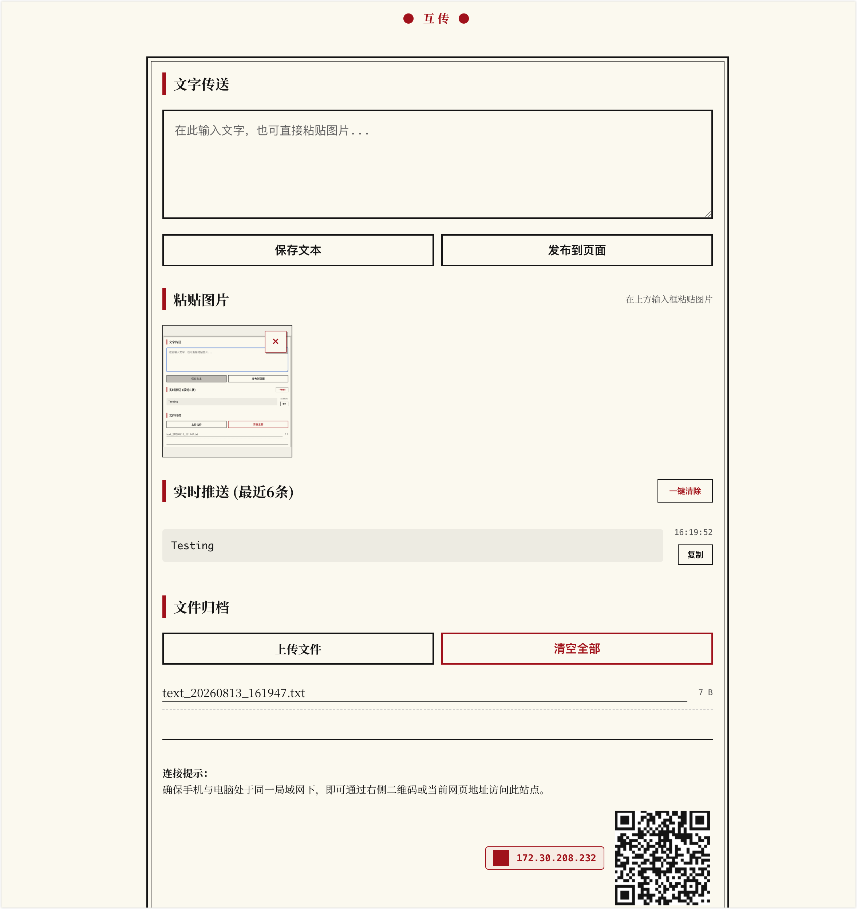

# LCTransfer（互传）

LCTransfer 是一个轻量的局域网文件与文本传输工具。程序在电脑上启动一个 Web 服务，同一局域网内的手机、平板和其他电脑可以通过浏览器访问，用于传递文字、文件和剪贴板图片。



## 功能

- 在设备之间上传、下载和集中清空文件
- 将输入内容保存为 `.txt`；对象或数组格式的 JSON 会保存为 `.json`
- 将文字发布到页面，实时同步最近 6 条内容
- 在文字输入框中直接粘贴图片并预览
- 支持粘贴 PNG、JPEG、GIF、WebP 和 BMP 图片
- 支持单张删除图片，并同步到其他已打开的浏览器
- 使用 Socket.IO 实时刷新文字、文件和图片状态
- 自动检测局域网 IP，并生成访问二维码

## 运行环境

- Python 3
- macOS、Windows 或 Linux
- 所有访问设备需要与运行 LCTransfer 的电脑位于同一局域网

## 安装依赖

在项目目录执行：

```bash
python3 -m pip install -r requirements.txt
```

项目当前依赖：

- Flask
- Flask-CORS
- Flask-SocketIO

## 启动方式

### 使用 `lct` 命令（macOS）

项目提供了 [lct](./lct) 启动脚本，脚本直接使用系统的 `python3`，不依赖虚拟环境。

首次安装命令：

```bash
chmod +x /Users/zendu/Desktop/LCTransfer/lct
mkdir -p ~/.local/bin
ln -s /Users/zendu/Desktop/LCTransfer/lct ~/.local/bin/lct
```

确保 `~/.local/bin` 位于 `PATH` 中。可以运行下面的命令检查：

```bash
command -v lct
```

随后可在任意目录启动：

```bash
lct
```

如果移动了项目目录，需要同时修改 `lct` 文件中的 `PROJECT_DIR`，并重新创建软链接。

### 直接使用 Python

```bash
cd /Users/zendu/Desktop/LCTransfer
python3 app.py
```

服务默认监听 `5100` 端口，启动后会自动打开浏览器。终端会显示类似地址：

```text
http://192.168.x.x:5100
```

其他设备可扫描页面二维码，或在浏览器中输入该地址访问。

按 `Control + C` 停止服务。

## 使用说明

### 传送文字

在“文字传送”输入框中输入内容：

- 点击“保存文本”会在 `uploads/` 中生成文件
- 点击“发布到页面”会将内容展示在页面中，并同步到其他浏览器
- 页面最多保留最近 6 条已发布文字；这些内容保存在内存中，程序重启后会清空

### 粘贴图片

先点击文字输入框，再使用 `Command + V` 粘贴剪贴板图片。图片上传后会显示在输入框下方、“文件归档”上方。

- 单张图片最大 20 MB
- 一次粘贴的图片总大小最大 60 MB
- 点击图片可以在新页面查看原图
- 点击图片右上角的 `×` 可以删除
- 上传和删除会实时同步到其他已打开的浏览器

### 文件归档

点击“上传文件”可以一次选择一个或多个文件。上传完成后，其他设备可以从文件列表下载。

“清空全部”只会清空 `uploads/` 中的归档文件，不会删除粘贴图片。

## 数据目录

未打包运行时，数据保存在项目目录中：

```text
uploads/         上传文件和保存的文字
pasted_images/   从输入框粘贴的图片
```

请勿在程序运行期间手动修改这些目录。如果需要备份，停止服务后复制对应目录即可。

## 项目结构

```text
LCTransfer/
├── app.py              Flask 服务端与 Socket.IO 同步逻辑
├── index.html          页面结构、样式和前端交互
├── css2.css            本地字体样式
├── all.min.css         图标样式
├── socket.io.js        Socket.IO 浏览器客户端
├── qrcode.min.js       二维码生成库
├── requirements.txt    Python 依赖
├── lct                 macOS 命令行启动脚本
├── build_exe.bat       Windows PyInstaller 打包脚本
├── run.bat             Windows 启动脚本
├── uploads/            文件归档目录（运行时创建）
└── pasted_images/      粘贴图片目录（运行时创建）
```

## 常见问题

### `lct: command not found`

确认软链接存在，并检查 `PATH`：

```bash
ls -l ~/.local/bin/lct
echo "$PATH"
```

如果 `PATH` 中没有 `~/.local/bin`，将下面内容加入 `~/.zshrc`：

```bash
export PATH="$HOME/.local/bin:$PATH"
```

然后执行：

```bash
source ~/.zshrc
```

### 提示缺少 Python 模块

重新安装项目依赖：

```bash
python3 -m pip install -r /Users/zendu/Desktop/LCTransfer/requirements.txt
```

### `5100` 端口被占用

macOS 可以使用以下命令查看占用端口的进程：

```bash
lsof -i :5100
```

停止已有的 LCTransfer 实例后再重新执行 `lct`。

### 其他设备无法打开页面

依次检查：

1. 两台设备是否连接到同一个局域网或 Wi-Fi。
2. 是否使用终端显示的局域网 IP，而不是 `127.0.0.1`。
3. macOS 防火墙是否允许 Python 接收传入连接。
4. 路由器是否开启了客户端隔离或访客网络隔离。

## 安全说明

LCTransfer 当前没有账号或访问密码。只建议在可信局域网中临时使用，不要直接暴露到公网。任何能够访问服务地址的设备都可以查看、上传或删除其中的内容。
